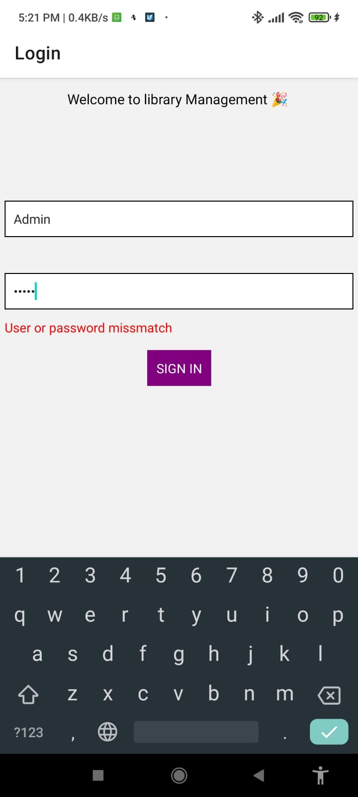

> Step 1 : clone repository

> Step 2 : npm install

> Step 3 : npm run start

> Step 4 : install expo application on mobile and scan qr code

`Username : admin`

`Password : admin`

<table>
<tr>
<td>

</td>
<td>

</td>
<td>

</td>
<td>

</td>
</tr>
</table>